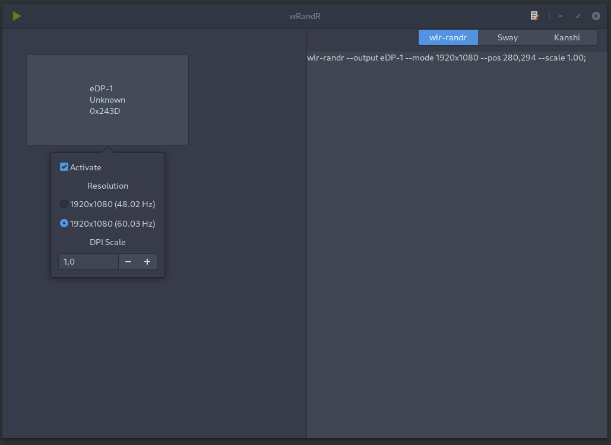

WrandR
======

aRandr for wayland.




## Install

```bash
$ go get -v -u github.com/csicar/wrandr
$ ~/go/bin/wrandr
$ # if you want to run it as a application
$ cp wrandr.desktop ~/.local/share/applications/
```

## TODOs

- [x] Snap to Border of monitors
- [x] Generate Command with VendorId & ID instead of Name
- [x] DPI Scale option
- [x] make text output kanshi-compatible
- [ ] Option to refresh

## Alternatives

If you want something with more features checkout [wdisplays](https://github.com/cyclopsian/wdisplays)
